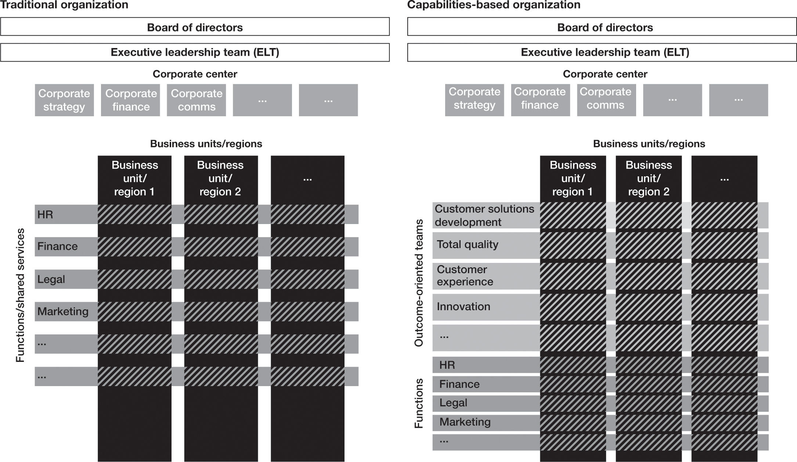

# 让你的组织以结果为导向
> 五个独立的手指是五个独立的单元。合上它们，拳头会倍增力量。这是组织。
>
> -- JC Penney 商店创始人 James Cash Penney

1990 年代后期，霍尼韦尔航空航天部门的领导者开始思考数字化、通信和连接性方面的进步如何为其航空业务创造机会。这些企业生产发动机、制动器、导航设备和航空电子设备等产品。他们还提供飞机维修和飞行信息软件等服务。
霍尼韦尔电子解决方案业务部（负责驾驶舱系统、导航、空间和安全）前总裁 Carl Esposito 回忆说：“我们对连接可以做什么以及它对我们当时的业务意味着什么有很多想法。”系统业务）。但是，他补充说，“我们需要技术来赶上[公司的愿景]。”手机还没有连接到网络；地理定位和通信卫星仍然在很大程度上针对军事而非商业用途进行了优化；引入了“物联网”一词，但最初只是为了推广 RFID 技术；云计算还处于起步阶段。
然而，十年后，技术正在迅速追赶。智能手机已经上网并成为日常生活的一部分。对卫星使用的军事限制已经放宽，更多的商业卫星围绕地球运行。物联网已经开始发挥其目前作为工商业信息骨干的作用。云计算已经成熟。到 2010 年，霍尼韦尔航空航天公司正在规划将该部门的产品和服务整合为“互联飞机”业务的方式，这将增加比其各部分总和更多的客户价值，例如通过为航空业提供实时解决方案客户，例如改进的电力和燃料使用、预测性维护、更精确的飞行计划以及实时的众包天气信息。
为了充分利用这个机会，霍尼韦尔必须在航空航天部门现有的制造和服务优势中增加连接和通信能力。它通过收购和合作伙伴关系做到了这一点。 2011 年，霍尼韦尔收购了专门从事机载通信设备和系统的 EMS Technologies。次年，霍尼韦尔与全球卫星服务提供商 Inmarsat 建立独家合作伙伴关系，为全球航空客户提供机上连接服务。
添加这些通信和连接功能是不够的。它们必须完全融入霍尼韦尔的日常工作方式。一旦公司领导层为新的互联飞机业务开绿灯，霍尼韦尔就意识到需要对其航空产品和服务业务进行重大重组，以将合适的人员、技能和能力整合在一起。 “在航空领域，”埃斯波西托说，“我们一直在以一种非常有条理、结构化的方式制造飞机，我们的功能是真正独立和隔离的。我们一块一块地建造它们，而不是从整体上思考。发动机、航空电子设备和电子设备之间的界限很难跨越——但这正是现在所需要的，因为连接性在所有这些产品中确实具有变革性。”
2014 年初，当时负责服务和连接的部门高级副总裁 Mike Edmonds（当时是一家小型企业）将在执行委员会会议上提交业务审查。他很自豪，因为他设法显着扩大了业务的利润。在庆祝这一成功的同时，执行委员会问他如何才能使业务的收入增长与他在底线所做的工作相称。埃德蒙兹说他会在 30 天内带着计划回来。 “三个小时后回来，”委员会告诉他。 “我们认为你知道该怎么做。”
确实，埃德蒙兹确实有一个计划的轮廓——但他没有与任何人审查过，这在霍尼韦尔文化中是一个危险的举动。在他回忆的那一刻，当会议重新召开时，他要求执行委员会进行彻底的组织变革：将 IT、数据分析和工程人员从他们的家庭职能部门整合到一个团队中，并授权聘请新的产品经理和具有数据分析技能的团队成员。霍尼韦尔航空航天公司时任首席执行官蒂姆·马奥尼 (Tim Mahoney) 说：“好的。我希望在一天结束之前发布新职位。我希望这些 IT、数据分析和工程人员向 Mike [Edmonds] 汇报，并在本周末前调动。”
随着转型的进行，新团队的任务是重新思考如何重新构想作为独立产品存在的遗留产品，以在更广泛的网络环境中运行。领导者需要确定特定类型的人员才能使这一切发挥作用。 “我们需要的是，”埃斯波西托回忆道，“是能够超越其职能领域的技术专长，思考我们试图解决的更大问题的人。”他将这些人称为“翻译人员”，他们能够促进不同技术专家之间的讨论，例如车轮和制动器、航空电子设备和连接性，还能够与营销和产品管理专家进行交流。 “一旦人们开始了解这些团队的不同谈话方式，想法的闸门就会打开，人们开始真正看到愿景以及可以去哪里。”
到 2015-2016 年，霍尼韦尔开始推出一些最有前途的想法，包括 GoDirect Connected Maintenance。该解决方案分析飞机数据并提供诊断以及预测性、规范性警报；它可以节省高达 35% 的维护费用。 GoDirect 还提供连接的天气雷达，可以在飞机之间共享数据，就像 Waze 为驾车者众包交通信息一样。此外，GoDirect 还为机组人员和乘客提供高速 WiFi 接入。
2019 年，该公司推出了 Honeywell Forge，这是一种下一代连接解决方​​案，它使用先进的数据分析来提供全面的飞行连接、飞行计划和优化以及飞行数据库服务组合。
不仅在产品开发中，而且在整个组织中都需要新的思维方式。 Connected Aircraft 前副总裁 Kristin Slyker 说：“我们花费了大量时间制定培训计划和进行内部沟通，以帮助我们的员工能够讲述简单的故事。” “我们一直在帮助他们就联网飞机进行类比交流；例如，谈到联网飞机有点像手机这一事实。我们销售类似于手机本身的硬件（例如天线）。我们与 Inmarsat 合作提供通话时间服务，例如 Verizon 或 Orange。最后，我们开发应用程序或软件应用程序，如飞行效率应用程序，帮助客户节省燃料。”
销售组织需要进行大量变革，传统上用于销售发动机等昂贵组件，而不是销售服务或解决方案。 “对于销售人员来说，出售价值 25 万美元的航空电子设备升级比出售每年 25,000 美元的十年维护计划更具吸引力，”埃德蒙兹说，“即使总美元可能相同。”
但霍尼韦尔坚持到底，不断重申转型的重要性。除了结构上的变化，领导层还改变了销售人员的激励结构，要求他们销售最少数量的服务来增加销量。该公司还提供了深入的培训，让销售人员感觉更自在“与人交流”。埃德蒙兹说，

> 我们意识到我们必须将重点远远超出我们自己的产品集并解决客户问题。我最好的客户会议是在我完全没有幻灯片的情况下坐下来介绍自己，然后说：“我真的对你的问题很感兴趣。你能告诉我你最大的延误和取消驱动因素是什么吗？”让他们谈论他们的想法。如果他们给我一些他们的数据来调查特定的维护问题，我可以为飞行员寻找其他维护问题甚至飞行服务问题，然后返回解决方案。这与我们过去的销售方式截然不同。

霍尼韦尔的互联之旅尚未结束，但它正在从一家工业公司转变为未来的软件驱动型工业公司，取得了长足的进步。如今，霍尼韦尔互联飞机业务价值 8 亿美元，被许多分析师认为是互联飞机领域的市场领导者。 Honeywell Forge 飞行效率平台标志着在设定道路上又迈出了重要一步：该系统在上市的第一年就被全球 128 家航空公司和一万多架飞机采用。
霍尼韦尔的互联飞机故事说明了我们之前提到的许多领导力要求。该公司展望了客户真正面临的挑战，围绕更大胆的价值主张重新定义了自己的位置，整合了正确的技术，然后将客户推向了这个方向。它利用技术进步不是为了复制别人的做法，而是建立自己的差异化价值主张。它通过收购来建立差异化能力。它与它的生态系统更紧密地合作。但随后霍尼韦尔也改变了组织工作的基本方式。它投资于培训和发展以及激励结构等扶持机制，以帮助人们摆脱旧模式并以新的方式工作。而且，一路走来，领导班子挺身而出，果断行动。
今天，许多公司都面临着霍尼韦尔面临的相同挑战。你创造价值的方式正在改变。你将需要构建、增强你的关键能力并将其集成到一个强大的价值创造引擎中，以帮助你在世界上的新位置中脱颖而出。构建该引擎并不断突破可能的极限是一项艰巨的任务，你需要将所有组织精力集中在交付这些能力所需的结果上。
随着价值创造模式的变化以及你的成功取决于扩展这些复杂的能力，你的工作方式必须改变，你的组织必须重新设计以支持这种新的工作方式。与霍尼韦尔一样，你需要将广泛而多样化的角色、技能和才能结合在一起，以提供竞争对手无法比拟的价值。你将需要人们流畅地协作，专注于他们的工作成果。你也很可能需要与传统组织范围之外的合作伙伴和人员进行协作。由于你需要不断创新、加强和调整你的能力以快速响应市场需求，因此你需要一个能够在许多方面实现自我指导的组织。
大多数组织不是为这种灵活、协作和以结果为导向的工作而设立的。他们继续在为前几个世纪的工作设计的更严格的组织结构中运作。

## 基于能力的组织：重新架构你的传统结构

在超越数字世界中获胜需要一种新的组织和团队模式。飞利浦前首席创新和战略官 Jeroen Tas 明确表示：“你需要多元化的团队来解决真正的挑战。你可能想要开发你的命题的下一次迭代。这不能仅由研发工程师完成。你可能有一个想要赢取的大帐户。你不只是对销售人员这样做。你可能有供应链问题。你不会只用物流专家来解决它。我们已经经历了一百年的功能分解。我们现在需要把它带回到工艺上；我们需要把不同的东西联系在一起。我们必须认识到，为了不同的目的，我们需要不同类型的团队。”
这种新模式并不是要让人们脱离职能角色，并要求他们将 10% 或 20% 的时间一起工作，或者工作六周或六个月（这是大多数公司使用跨职能团队的方式；请参阅“超越传统的功能模型”）。这是关于建立更持久、以结果为导向的团队，负责产生你的每项差异化能力所需的结果，以便你能够实现你的价值主张。由于贵公司的差异化能力不是单一功能的，因此这些团队必须将整个组织和整个生态系统所需的一切整合在一起。

### 超越传统的功能模型

大多数公司的组织模式可以追溯到 19 世纪。一些最早的商业工作人员是管理时间表的铁路电报运营商。然后是销售人员、财务部门和研发实验室——包括托马斯·爱迪生和亚历山大·格雷厄姆·贝尔的原始实验室。随着公司变得越来越大和越来越多样化，他们开始增加业务部门和区域组织结构以更好地服务于各个市场，最终创建了矩阵式组织，其中大多数人都有两条报告线——一个职能部门和一个业务部门/区域特定的部门。在大多数情况下，人力资源人员将继续主要从事与人力资源相关的工作，而财务人员将主要从事财务工作，导致通常被认为是职能孤岛。
职能部门一直在职能专业知识的发展、员工技能的提升和职能职业道路的提供方面发挥着关键作用。然而，这个角色在超越数字时代受到了抨击，因为公司竞争所需的技能和能力的特殊性爆炸式增长，更不用说取胜了。想想现在擅长营销意味着什么：分析、用户体验设计、买家行为理解、数字资产管理、社交媒体参与、公共关系、品牌、广告，以及更多需要的技能。不再有通用的营销人员，也没有通用的营销职业道路或通用的营销技能提升工作。所需的技能变得更加复杂和专业。
这导致公司评估他们应该拥有哪些技能，以及他们最好从他们的生态系统中获取哪些技能。虽然公司已经习惯于在公共关系或创意发展等特定领域依赖外部人才，但在这些领域缺乏吸引、发展和留住优秀人才的机会，但他们现在需要在更广泛的技能领域采用这种思维方式——专注于他们有足够规模和能力吸引顶尖人才的领域，并利用一个大大扩展的生态系统，在其他地方提供独特的技能。
尽管有这些发展，但根本的挑战是，领导者专注于“卓越功能”并几乎默认建立大型职能组织的传统模式导致他们忽视了需要实现的最终结果。动机和激励可能会出现偏差：运营部门可能会争取标准运行，而研发部门则需要精致的定制；销售希望满足客户，而服务则旨在管理成本。另一个挑战是职能部门倾向于根据行业职能基准来衡量自己，而不是做有助于推进公司非常具体的战略的非常规事情。当公司最具影响力的工作本质上是跨职能的时，单靠职能部门来构建未来是极其困难的。
然而，在当今的价值创造模型中构建和扩展差异化能力的途径需要更多的跨职能专业知识和协作。仅仅依靠财务人员在财务工作上做得很好然后移交给下一个职能部门是不够的。今天，财务人员还必须例如学习数据分析技能，知道如何使用技术，并与销售、营销和运营职能共生，以帮助准确预测和匹配供应与需求和价格产品和服务在完全正确的水平。财务人员必须与运营生产主管、销售经理或营销产品经理一样齐心协力并积极主动地实现运营效率、收入和利润目标。他们都必须变得更加以结果为导向，而不是以功能输出为导向。随着成功所需的差异化能力变得更加复杂和跨职能，这尤其如此，需要快速拼接在一起并不断改进来自整个公司的洞察力、技能、流程、数据和技术。
为应对这些挑战而创建的人类技术——“跨职能团队”——将不同的职能和单位聚集在一起以实现特定的目标或项目，在许多组织中变得无处不在。例如，考虑由来自客户服务、制造、研发和产品营销团队的成员组成的跨职能工程团队，他们齐心协力解决质量问题。这些团队可以很好地开展有针对性的工作，例如项目、计划、变革计划和沟通计划。但事实证明，它们在持续创造价值方面并不成功。这是因为在许多情况下，他们缺乏真正发挥作用的持久力和影响力，而且他们的成员有许多职能职责，这些职责优先于团队应该实现的目标。如果职能部门继续拥有人才并影响职业方向，那么无论跨职能团队的意图如何，他们总是会在确定议程和重点的竞赛中获胜。通常这些团队没有得到最好的人才。他们缺乏与预期结果相关的明确目标、指标和激励措施；而且他们在高级决策级别上没有这项任务的重要性所必需的影响力。这些团队有时是有用的工具，但它们不是建造房屋的蓝图。
其他公司试图通过在传统矩阵组织之上覆盖端到端流程模型和角色来解决这一挑战。换句话说，他们保持传统的职能和业务单元矩阵，但告诉人们如何将工作从一个步骤切换到另一个步骤，以提高协作效率。虽然当你实施跨职能的新企业资源规划系统时可能需要这些端到端流程模型，但它们通常不是解决你如何创造价值挑战的解决方案。实际上，它们通常最终成为映射“标准”流程并向组织添加另一个决策检查点（以全局流程所有者的形式）以管理和验证人们遵循流程的复杂练习。但是，当你必须在当今世界迅速做出反应并跳出蓝图流程以做必要的事情以赢得市场时，你会怎么做？当传统的功能矩阵模型仍然是组织的上层建筑时，端到端流程模型总是僵化且帮助有限。
无论流程多么出色，都很难复制人们作为一个具有共同目标的团队一起工作的敏捷性和独创性。

为了让这些以结果为导向的团队取得成功，他们需要：

- 要长寿。由于他们创造的能力是公司成功的核心，因此这些团队需要留在这里。然而，它们的大小和组成会随着能力本身的发展而随时间而变化。
- 让团队成员全职致力于构建和扩展你选择的差异化能力；这些能力太重要了，不能成为“附带任务”。
- 拥有自己的资源——人员和预算——而不是从职能部门和业务部门借钱。如果差异化能力是贵公司成功的关键，那么这需要反映在你分配预算和投资的方式中。
- 由高级管理人员领导，通常是公司高层团队的成员，他们在公司的决策桌上享有平等的席位。

我们已经看到许多公司改变了他们的组织结构，并创建了以结果为导向的精选团队，这些团队寿命长且跨界。这些在创新能力中变得很普遍，公司打破了研发与客户洞察、营销、销售、服务、运营和财务等其他职能之间的传统孤岛。这些团队专注于创新，将其作为一种真正集成的能力，在整个组织中工作。他们的成员不是“借”给创新团队的，他们是一个全面运作的以结果为导向的团队的一部分，并且作为一个清晰的单元一起工作。许多人包括团队中传统组织边界之外的生态系统合作伙伴和客户。同样，医院建立了患者体验团队，专注于改善患者的治疗效果和满意度，并协调心脏病学、重症监护、护理和物理治疗等部门。
其他示例包括：全面质量团队（整合来自研发、制造、供应链、物流、营销、销售、财务和客户服务的人员）、客户体验团队（将整个价值链的人员结合起来，拥有并塑造客户旅程)，以及消费品公司（整合财务、营销、销售、数据、技术和供应链）的收入增长管理和市场执行团队。
在以能力为基础的新组织中，以结果为导向的团队与职能部门并肩作战，专注于提供公司的差异化能力。这些团队与企业中心、业务部门和职能/共享服务共存（见图 5-1），但日益成为组织中更为突出的元素。在许多组织中，我们看到大部分职能员工都嵌入到以结果为导向的团队中，并在不同的团队和业务部门之间轮换，以发展更广泛的技能和协作的工作方式。事实上，大部分组织预算和人员支出都从传统的职能领导转向以结果为导向的团队，从而使这些团队能够以连贯的方式推动公司围绕差异化能力的优先事项。简而言之，以结果为导向的团队的实施使组织的结构与需要完成的最重要的工作保持一致，以交付对你的价值主张和客户至关重要的结果。
因此，在基于能力的组织中，纯职能团队变得更加专注于专门的单一职能工作（例如，投资者关系或劳资关系）和推动职能专业知识（例如，通过制定政策和程序，建立适当的治理职能专业知识，在整个组织内分享和发展职能最佳实践，以及培养满足组织其他部门所需的职能人才和技能）。虽然对公司的成功仍然至关重要，但在此模型中，职能部门直接管理一个较小的领域，但间接影响和支持整个组织的价值创造模型。他们的角色仍然很重要，但与对大多数活动的直接所有权相比，它们具有更多的间接影响和指导。
在过去的二十年里，一些读者可能会在他们的共享服务组织不断扩大的范围和作用中认识到这种模式的一种形式。 整合交易功能活动（例如，应付账款和应收账款）的交易中心的旧共享服务模式如今已在许多组织中演变为跨职能集成的端到端业务成果服务（例如 ，营运资金优化）由数字和数据洞察能力支持。 在许多组织中，这些以结果为导向的业务服务集团已成为员工人数最多的所有者——包括公司员工和外部合作伙伴。 我们将这一现象视为基于能力的组织的一个领先指标，随着越来越多的公司超越数字化，它将变得更加突出。
图 5-1
从传统组织到基于能力的组织

在这种新模式中，业务部门变得更加以客户和市场为中心（而不是以产品为中心），并发挥着越来越重要的整合作用，以确保根据客户需求适当塑造能力。这种集成角色与旧的“一般管理”角色非常不同，它更多地关注如何与客户互动，而不是组织所有需要交付的活动。事实上，业务部门的角色更多地是以满足客户特定要求的方式组装以结果为导向的团队的输出。
创建正确的以结果为导向的团队，首先要明确定义你的差异化能力和他们需要产生的结果——不是他们今天能够产生的结果，而是他们需要为你的公司创造什么，以实现你重新想象的位置世界。该能力蓝图定义了交付所需结果所需的专业知识、知识、技术、数据、流程和行为——就像架构蓝图定义了结构的各个方面必须如何结合在一起一样。能力蓝图将帮助你确定具备合适技能的人员，你需要将他们组合在一起，并授权他们跨越旧界限开展工作，以交付你需要的成果。从哪儿开始？贵公司创造价值的能力越重要，所需的技能越多样化，就越迫切需要采取行动。
在许多公司中，从功能型组织模式到以结果为导向的组织模式的转变并非一朝一夕之事，而是一波三折。但鉴于公司迫切需要建立交付其重新构想的地方所需的能力，他们将需要考虑如何加速转型。仔细评估如何分阶段进行更改，以便将最重要的功能和正确的资源结合在一起。
在一些组织中，公司开始采用新的工作方式，例如敏捷方法——将来自不同职能、具有非等级角色的人员聚集在一起，以结构化的冲刺方式工作，以支持解决复杂主题的问题。而在其他组织中，共享服务中心甚至全新的团队都被要求进行新的能力开发。虽然这些可能是有用的步骤，但它们本身通常不足以实现组织工作方式所需的那种转变。事实上，如果不是更大变化的一部分，有时这些新团队将难以产生影响，被视为“海盗船”，无法融入整个组织。

## 微软的基于能力的组织之旅

微软在 2014 年任命萨蒂亚·纳德拉 (Satya Nadella) 为 CEO 后开始了转型，这是“微软的更新”。改变的理由很明显：个人电脑的季度出货量下降到 7000 万部，而智能手机的出货量则飙升至 3.5 亿部以上。这对微软来说是个坏消息，因为其 75% 的收入来自预装在 PC 上的 Windows 软件。更糟糕的是，该公司在移动或其他新兴技术（如云计算、社交媒体、软件即服务解决方案和大数据）方面进展甚微。很难看出微软将如何在快速发展的技术市场中取得成功。
微软全球销售、营销和运营执行副总裁兼总裁 Jean-Philippe Courtois 回忆说：“我们很清楚，25 年前让我们走到今天的东西，在未来不会让我们走到今天。作为一家公司，我们的使命是有一天“每张桌子、每个家庭都有一台电脑”，这真是太棒了。它确实推动了我们前进。但这还不够。因此，我们形成了一种新的世界观：“随着我们周围发生的巨大变化，世界上的每家公司都将成为一家数字公司，世界上的每个人都需要成为数字原生代。世界正在成为一个云优先、显然是移动优先的世界。’”
如果他们落后了，他们如何帮助客户进行数字化转型？在担任 CEO 的第一天，纳德拉宣布了“移动优先，云优先”的新战略，后来演变为“人工智能/云优先”。微软的旧使命宣言——“每张桌子、每个家庭都有一台电脑”——已被淘汰，取而代之的是“让地球上的每一个人和每一个组织都能取得更大的成就”。前者是关于向客户销售产品；后者是为客户提供结果——换句话说，解决方案。
“我们必须进行的转型是巨大的，”Courtois 说：

> 我们从一家公司的传统人员、技能、组织、流程、工具和能力开始了这一旅程，该公司用于向世界上最小和最大的客户许可软件协议，之后几乎没有持续的客户互动。现在我们明白了，我们的新世界观要求我们从一家面向软件的公司转变为一家面向云的公司。这意味着，例如，我们必须彻底改变创新的步伐，从过去 3 到 4 年的软件发布周期转变为每隔几周创建新服务和解决方案的团队。

这也意味着微软必须更加专注于推动其客户对云服务的消费。
支持微软更新的关键组织变革之一是公司全球商业业务的转型。改变是一项艰巨的任务。几个月来，70 名高管和约 400 名高级管理人员制定了一项战略，该战略于 2017 年 2 月公布，深刻改变了微软商业部门进入市场的方式。转型围绕五个支柱组织，以在正确的时间为正确的客户提供正确的资源，使 Microsoft 能够支持其客户进行数字化转型并推动消费：

- 行业覆盖。公司围绕特定行业重组销售组织，提供量身定制的专业知识和服务，帮助客户转型；前一种方法更多地涉及充当软件或基础设施服务提供商。
- 技术专长。它通过在现场销售团队中包括工程师，使技术能力更接近客户。
- 客户成功。通过更深入的售前和售后客户互动，促进云服务的使用和消费； Microsoft 工程师、顾问和开发人员经常在现场工作。
- 数字销售。它通过使用数字基础设施和人工智能来增强销售人员的能力。
- 一位商业伙伴。该公司简化了生态系统合作伙伴与自己的销售组织之间的参与规则，使合作伙伴能够更有效地为客户服务。

一些关键的组织变革旨在将公司从其传统职能（售前、销售和售后）转移到更专业的角色，以更好地满足客户的需求。其中包括重新调整专业客户团队单位，以更好地支持公司的企业客户（顶级客户）与行业专家。这些变化还涉及重新调整专家团队单位——包括解决方案专家和技术解决方案专家——以专注于获取新客户和为现有客户提供技术支持。此外，这些变化意味着创建一个客户成功单元，以向企业客户展示云的价值，促使采用更多服务并增加消费。凭借所有这些不同的技能，微软新的以结果为导向的团队已做好准备，以实现公司在世界上的新地位。 “我们还有一个我们称之为‘全球黑带团队’的覆盖层，他们在全球或区域层面上工作，以帮助实现更先进的能力，”Courtois 说。
微软以这种方式组织有两个关键原因。正如 Courtois 解释的那样，“第一个原因是因为我们需要一套多方面的技能和工作方式，以便在客户的转型周期中陪伴他们。每家公司都在成为软件公司。这不仅仅是将一堆虚拟机迁移到云端，而是建立新业务和新模式。我们需要所有这些能力来与我们客户的业务及其业务战略更加亲密。”
第二个原因是文化。微软一直是一家以产品为中心的公司，如果它想成为一家“以客户为中心的公司”（正如它自称的那样），就必须采用不同的组织方式。库尔图瓦认为，

> 我们必须自始至终支持客户的转型：首先，我们需要设想客户所需的数字化能力。然后，我们必须与我们的客户合作，根据他们的传统架构和他们作为一家公司的身份，确定什么是正确的技术架构来构建这种能力。然后我们需要以更快的速度将其转化为许多项目，以创建数字产品、数字运营、数字客户旅程等。为了推动这种文化变革，我们必须创建一种非常不同的组织能力在地上。

当新组织于 2017 年 7 月 1 日上线时，全球销售、营销和运营以及全球商业业务部门的 4 万人的工作一夜之间发生了变化——从最常见的角色或客户主管开始。
“我们改变了 90% 的领导者和大约 80% 的非领导者的角色。这是一个相当大的变化，”全球销售、营销和运营领域转型副总裁 Nicola Hodson 回忆道：

> 在 2017 年 7 月 1 日发布之前，我们有大约 6 个月的时间来计划、测试并开始让各级领导层参与这些变化。我们付出了很多努力和计划来建立一个支持联盟。我们从一个小型核心团队开始，负责规划工作和设计。我们扩展了它，让更多的现场人员来正确地测试它。然后，我们花费了真正的时间和空间来吸引区域领导者和他们的领导团队。到 5 月底，我们已经与所有领导人进行了交谈。我们已经向他们解释了这些变化。我们已任命他们担任新角色，当我们在 7 月 1 日与整个组织进行沟通时，他们都已安全并准备就绪。

在公司于 7 月 1 日点击“开始”后，当然，并非一切都完美——有些事情需要进一步详细说明或改变。那时，聆听前线数以万计的人开始体验新模式变得非常重要。 Hodson 回忆道：“我们建立并运行了一个实时问答系统。我们每天都与核心团队一起讨论提出的问题。我们有一个由来自不同业务部门的人员组成的团队，我们将他们交给了他们。我们在所有领域进行了很多深入的聆听之旅，以了解哪些方面做得好，哪些方面做得不好，并确保我们在事情没有按计划进行的地方非常注重行动。”

## 重新设计组织的 DNA 以关注结果

正如微软和霍尼韦尔的例子所说明的那样，让这种基于能力的组织运作并不能通过简单地改变组织结构图上的线条和方框来实现——你可能需要修改甚至重新设计组织的 DNA 来实现它更加协作，并更多地关注结果。除了为关键的以结果为导向的团队进行架构和蓝图设计工作之外，我们还看到领导者最强调四个推动因素，因为它们可以成就或破坏你重新架构组织的努力：分配投资和预算的方式；你如何定义、衡量和奖励绩效；你如何建立职业道路；以及你如何通过鼓励新行为来发展你的文化。

### 重塑你的计划和预算流程，将投资分配给你的优势

为了使基于能力的组织发挥作用，你需要重新考虑如何分配预算和投资以及如何管理损益。这是领导者必须将公司的活动集中在最重要的事情上的最有力的杠杆之一。鉴于差异化能力对你的组织的成功至关重要，你的大部分支出将需要用于构建和扩展这些能力。由于以结果为导向的团队是贵公司差异化能力背后的主要驱动力，因此你的大部分投资需要投向这些团队。事实上，我们会争辩说，如果你没有大幅重新分配投资，并且你的预算变化很小，那么你对过去的投资可能比对未来的投资更多。
这将对损益表的管理方式和你的计划流程产生潜在的重大影响。你的以结果为导向的团队必须选择他们需要的投资以及他们需要为他们提供的职能，而不是职能领导者确切地规定他们需要多少人以及他们需要投资什么工具。同时，必须根据以结果为导向的团队的最低质量标准、预算和计划来考虑功能卓越性要求。同样，你的以结果为导向的团队将需要为业务部门定义要求和目标，以便在他们的计划活动中考虑（反之亦然）。这种从传统矩阵组织的规划和预算管理转变将需要重新考虑能够实现治理和协作的规划流程和机制。谁领导计划周期，预算如何最终确定，谁参与了这一年的业务审查，以及整个组织的决策如何做出，都需要重新设置以支持新模型的工作。为了释放组织差异化能力所需的资源，你需要在应该“点亮”的领域（这是必要的，但你应该尽可能少花钱）和赌注（你需要与竞争对手一样好，但不是更好）。这种变化可能需要迭代和微调，以将组织内所需的权力平衡带入真正协作以实现价值创造成果的团队。

### 重新设计定义、衡量和奖励绩效的方式

要将组织的重点转移到构建和扩展你的差异化能力上，你需要将组织的指标更改为你想要实现的结果。哪些指标合适取决于你的具体情况。它可能是新创新的上市时间、碳足迹和可持续性影响、客户满意度、你对整个生态系统成功的影响，或者（如微软的案例）客户对服务的消费（衡量客户是否正在体验结果）。微软做出的重大改变之一是它如何补偿员工。不再是合同的价值，而是客户随着时间的推移的消费。该公司衡量其所有客户的消费情况，这使领导者能够让各个销售人员参与讨论他们面临的障碍，以使他们的客户向前发展。微软所做的——以及任何旨在将基于能力的组织变为现实的公司必须做的事情——是根据特定结果而不是产出来衡量绩效和薪酬。
一些组织，如律师事务所和咨询公司，甚至将员工奖金激励与客户取得的成果联系起来。这些公司并没有仅仅根据他们产生的收入来衡量和支付员工，而是包括他们的客户是否达到了所要求的结果。这些激励措施需要仔细校准，因为客户结果可能不会在典型的年度绩效评估周期内产生。然而，这种激励措施创造了一种强大的机制，使组织专注于合作以实现真正创造价值的成果。
你还需要重新考虑个人激励与团队激励的平衡。今天的大多数激励措施都与销售产品或服务有关，因此很快就会得到一个单一的责任点：这个人是否达到了他们的销售配额？领导是否兑现了承诺？虽然这些激励措施很重要，但你还需要确保在构建和部署公司的基本优势——能力系统方面取得进展。这需要以结果为导向的团队、职能部门和业务部门之间进行有意义的合作，这些团队必须接受、整合、改进和整合这一优势。需要建立这些基于团队的目标和激励措施，并与对个人绩效和行为的期望进行适当平衡，以使你的转型取得成功。
你还需要更改执行绩效评估的方式、参与这些评估的人员以及该评估中的对话类型。作为微软采用基于能力的组织模式之旅的一部分，Courtois 取消了他们传统的年中审查，他发现这与公司的新工作方式不符。这不仅导致领导者花费太多时间远离市场和客户，而且如果某个领域的表现落后，它还会导致演讲和指责。 Courtois 将其替换为季度业务联系，团队围绕业务趋势、障碍和问题、主要见解以及他们作为一个团队需要做些什么来取得成功进行共享对话。讨论的焦点更多地集中在为取得成果而采取的集体行动和所需的帮助上。由于贵公司创造持久价值的能力取决于交付综合成果，因此你也需要将绩效对话转变为专注于协作成果。

### 建立使流动组织成为现实的职业模型

过去传统的层级发展模式，人们将整个职业生涯都花在一个职能部门，然后通过一系列垂直晋升来提升，现在已经不需要了。为了提供关键的跨职能能力，使你在世界上占有一席之地，你将需要在其专业领域内拥有丰富经验和跨领域多元化经验的员工。这种深度和广度的经验也越来越多地成为员工在快速变化的商业环境中保持技能相关并保留多种职业选择的需求。我们已经在特定领域的许多组织中看到了这种模式，事实上，今天的高级领导团队比几十年前拥有更多不同的经验，这不仅反映了这一职业轨道的日益普及，而且反映了它培养优秀领导者的能力。
这种类型的跨学科模型可能不适合你的整个组织，但公司必须阐明一套新的职业道路和发展选择，以帮助人们建立他们需要的技能。在这些新路径中，人们通过许多不同的职能和团队在一系列横向移动中取得进展。他们不必成为管理者和领导者才能成长；在团队中扮演贡献者的角色也可以让人们成长。人们还可以扮演“翻译者”的角色——利用他们的影响力而不是职位权威来促进以结果为导向的团队、职能部门和业务部门之间的协作。在这种新型的职业模式中，人们的评判和奖励不是基于管理越来越多的内部资源，而是基于他们对团队的贡献和他们负责的结果。在极少数情况下，人们甚至会花费一部分职业生涯与生态系统合作伙伴合作，并在公司之外开发经验。一些公司通过创建借调计划将这一发展过程制度化，以派遣关键人才为合作伙伴组织工作一段时间，然后返回他们的“家乡”组织——我们期望更多的公司将员工派往合作伙伴，因为我们整合了能力并需要确保为生态系统在社会中的角色服务的信任和无缝性。总而言之，在以能力为基础的组织中，职业道路也需要从以结果为导向的思维方式设计——专注于获得最佳结果所需的一切，而不是基于传统的组织层次结构视图。
花旗集团前首席执行官迈克尔·科尔巴特与此有关。他说，在过去，“人们习惯于在相对狭窄的垂直领域开展职业生涯，负责优化垂直领域，并在垂直领域上升。”但要创造花旗集团旨在为其客户提供的最佳体验（见第 2 章），需要公司将许多不同的能力结合在一起。人们现在通过许多横向移动取得进步，从而获得更广泛的经验和协作技能。 “工作没有更多的直线。我们为人们提供更精心策划的职业生涯，”Corbat 补充道。
随着我们进入一个超越数字化的世界，鉴于职业道路的多样性和复杂性，人们将需要更多的一对一职业指导和指导。不再有一条通向上方的高速公路；有许多不同的道路有许多横向移动。你应该考虑的一些步骤：

- 在你的职业模式中建立一种理解，即人们不需要拥有职位权威或管理大型团队来成长和发展。通过跨多个角色、团队和经验工作，可以实现职业发展和相关的经济回报增长。
- 鼓励人们冒险并进入他们传统的职能专业知识和培训之外的职业。支持他们做出这些改变。
- 建立明确跨界的人才审查流程，并明确选择人们在他们认识和目前工作的团队之外还能做什么。人才流程还需要包括让人们有机会与生态系统合作伙伴、客户和其他人开发在组织内有价值的经验。
- 帮助人们培养在新环境中茁壮成长所需的技能（有关提升技能的更多信息，请参阅第 7 章）。

### 通过塑造新行为来促进变革

要求人们在这种基于能力的新模式中工作是一个巨大的转变。他们将不得不放弃传统的职能忠诚度和优先事项，以围绕新结果重新定位他们的思维——在许多情况下，这些结果将随着时间的推移而不断创新和转变。他们将不得不学习可能对他们来说陌生的新技能，或者他们过去可能依赖于其他人的新技能。这一次，他们将无法依赖 IT 人员为他们运行数据分析，而是必须学习如何在运行中进行数据分析并运用他们的专业知识。传统的权力和决策结构将在他们周围发生变化，他们将不得不学习如何通过与他人合作和通过他人来取得成果，而不是依靠个人的努力。所需的心态和行为改变很可能是重大的，甚至可能是不自然和令人不安的。
改变预算、指标和激励措施等正式措施会有所帮助，但如果不明确帮助他们塑造和实践新行为，你就不会成功地“取消培训”和重新培训人们以新的方式工作。换句话说，你将需要一种润滑脂来帮助组织以所需的方式工作，并塑造能够加强你的价值创造系统的文化。
在阐明你希望人们采取的行为时，请确保它们是具体的、可见的、可操作的、情感共鸣的，并且理想情况下是激励性的。根据你的具体情况，关键可能是诸如促进关于质量、速度和预算之间权衡的明确对话等行为；自由且自愿地提供专家意见（但如果有人决定另辟蹊径，请支持他们）；做出决定并清楚地阐明决定背后的事实；并明确地将资源与优先机会相结合，以最大限度地发挥影响。
要使微软的商业转型计划取得成功，领导者知道他们必须定义新的销售方法应该是什么，并尽可能衡量组织是否朝着正确的方向前进。正如 Jean-Philippe Courtois 解释的那样，他们对希望人们表现出的新行为的定义非常精细：

> 首先，我们需要我们的员工更多地与业务决策者而不是 IT 人员接触——这很容易衡量。其次，我们定义了他们在参加客户会议后应该如何触发正确的对话——他们如何向客户学习，以及他们如何通过智能对话获得相关性。第三，在他们在第一次会议中确定相关性之后，他们如何指出一种参与模式，在这种模式中，他们将让相关行业专家和数字顾问与客户一起进行一些业务设想并制定议程微软可以支持的转型？第四，他们如何将我们的技术人员和客户的技术人员聚集在一起，以便将其转化为我们需要构建的数字能力？

这种新的行为模式得益于对培训和发展的大量投资以及组织如何在实践中实施行为的参与。
礼来公司说明了领导力在促成这些关键行为以及消除阻碍和障碍方面发挥的关键作用（我们将在第 6 章更详细地讲述礼来公司的转型故事）。礼来公司要想成功转型，最重要的当务之急之一是加快公司的创新进程。这需要对组织和领导角色进行正式变革，例如在研发的后期阶段给予五个新业务部门的负责人更多的参与和更多的决策权。但它也要求人们改变他们的行为方式。 “礼来公司对变革的抵抗力特别强，因为礼来公司是该地区最大、最具吸引力的雇主，而且几乎没有其他选择，”研发改革的共同领导者 Dan Skovronsky 说。 “人们害怕冒险，因为失去工作可能意味着收拾家人并搬家。那么，为什么要尝试追逐事物呢？最好还是低着头继续在这里工作，因为这是一个工作的好地方。”
然而，抵制变革是失败的模式，因为公司需要比过去更快地开发新药并将其推向市场。传统上，它创造的环境是一个最重要的事情是你要达到你说你要达到的最后期限，这导致人们创造了慷慨的缓冲最后期限，这反过来又导致礼来成为最慢的人之一。行业。 Skovronsky 说，

> 我们需要设定雄心勃勃的目标，而不是在人们没有达到目标时惩罚他们。我们必须让员工相信他们不会失去工作，不会因为冒险而被降职，但没有成功。我们需要向他们展示，事实上，这是晋升的途径。我们告诉他们，“忘记缓冲区。给我一个真正激进的行业最佳时间表。告诉我你需要什么来实现它，如果你错过了几周或几个月，不要害怕。你尝试做一些非常大胆的事情，这意味着你仍然会比以前更好。”我们有一些团队错过了截止日期的例子，但他们的截止日期非常激进、无缓冲、一流。他们迟到了两个月，但比旧系统快了两年。我们奖励他们，让他们成为英雄，并围绕他们讲故事。而且，我想说——最重要的是——是实现改变所必需的。

虽然这些可能是好故事，但塑造导致你想要的结果的正确行为需要真正的工作。这是一项战略性的练习和努力，不能任凭运气或人力资源部门来解决。在该领域的多年研究和工作告诉我们，塑造行为需要定义你希望在你的组织中看到的少数关键行为并刻苦培养它们。 ^1^
完美的关键行为没有万能的答案。然而，普华永道思略特的卡岑巴赫中心是一个全球文化和领导力知识中心，它的工作告诉我们，可以通过几个简单的步骤来塑造关键行为：
以中立的方式盘点和理解组织现有的文化特征和行为——意识到你当前的行为既有积极的影响，也有消极的影响。评估你现有的文化如何支持和阻碍你的战略。 （有关更多信息，请参阅卡岑巴赫中心的文化指纹调查。^2^）
让人们了解需要哪些特定行为来支持你的新工作方式和新的价值创造模式。具体一点：它看起来像什么？感觉怎么样？你已经在哪里看到了这些行为？
让人们确定是什么阻碍了展示这种行为。可以采取哪些做法来实施该行为？哪些促成因素会有所帮助？需要清除哪些障碍？
使它成为现实。将促成因素落实到位并消除障碍。为榜样人物提供传播行为的平台。让人们将行为转化为与其日常工作相关的具体行动，并将其与战略目标直接联系起来。在财务与销售方面合作意味着什么？领导和主管可以关注哪些行为来激励一线员工调整行为？不断完善行为，使之成为现实。 ^3^

建立一个基于能力的组织是一个伟大的目标，但自然会在我们强调的所有领域（结构、预算和规划、绩效管理、职业道路以及人们的行为方式）中进行侵入式变革，所有这些都是相关的。在许多情况下，你需要重新考虑甚至撤销公司的基本工作方式。正是出于这个原因，我们看到许多公司分步进行这一旅程，在迁移整个组织结构之前引入精选的以结果为导向的团队。这为成熟的人员流程、治理流程和其他重要的推动因素提供了时间，以使基于能力的组织能够正常工作。
然而，改变组织的理由是不可避免的。当你创造价值的基本模式发生变化时，组织必须发生变化。转型需要使能力和成果浮出水面，并使它们成为组织的主要关注点。这并不容易。旧组织中的防御将被激活。但改变至关重要。因此，你的顶级团队必须全心全意地接受它。正如我们将在下一章中看到的那样，顶级团队本身也必须改变。