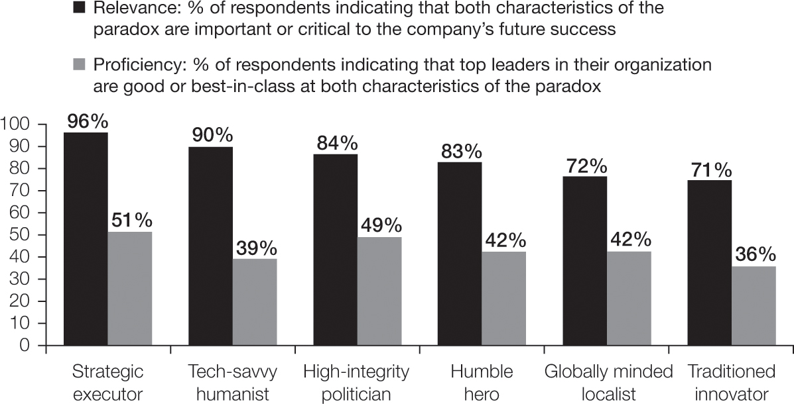
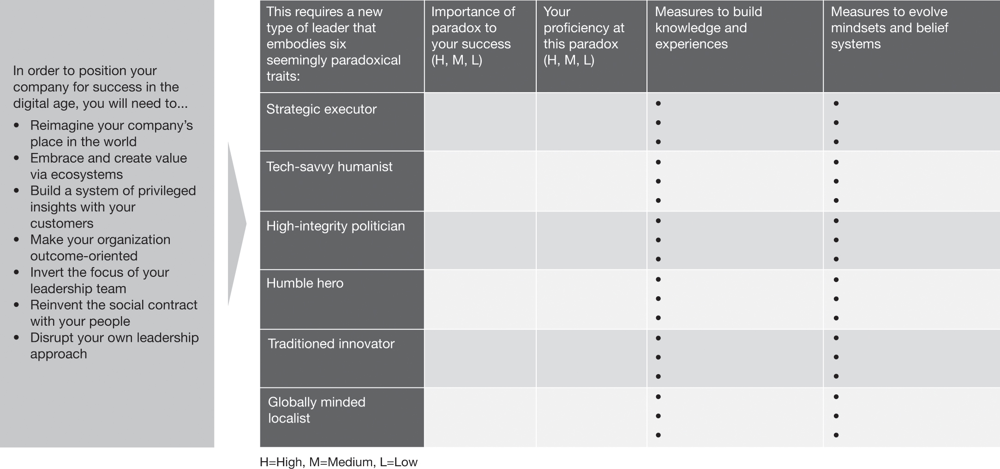

# 颠覆你自己的领导方式
> 意识到自己的一个缺点比意识到别人的一千个缺点更有用。
>
> -- 丹增嘉措，第十四世，现任达赖喇嘛

当我们为本书进行研究时，让我们印象深刻的一件事是，我们采访的领导者始终强调他们自己必须至少像他们的公司一样进行转型。如果不破坏自己的领导方式，他们就无法重新构想公司创造价值的方式，重新构建组织和领导团队，或以有意义的方式吸引员工。换句话说，如果不破坏他们自己的领导方式，他们就无法改变他们的公司并定位他们在超越数字时代的成功。
飞利浦首席执行官 Frans van Houten 回忆说：“我需要的领导之旅是一段深刻的旅程。” Van Houten 于 1986 年加入飞利浦，从营销和销售开始，并在公司的三大洲担任多个全球领导职务。自 2000 年代初以来，他认为自己很幸运有机会领导大型组织。 1999 年，他的领导之旅中的一个重要步骤是负责亚太地区的消费电子业务。屁股在课堂上。那对我来说是一次重要的对抗，我永远不会忘记，”他说。
2004 年，van Houten 成为半导体业务的 CEO，并带领其 2006 年分拆到 NXP Semiconductors，并继续担任 CEO。正如他所描述的那样，“这对我来说又是一次重大的领导变革。我们有非常苛刻的业主，我不是半导体专家。这意味着我必须推动变革，而不能让自己被那些对半导体了解更多但抵制变革的人阻碍。在那些年里，我做了很多变革性的改变。它运作良好，尽管最终我被要求在 2008 年底深入危机。这是一次令人羞愧的经历——这可能也很好。但我知道，如果一扇门关上，其他门就会打开。” 18 个月后，他回到飞利浦，担任首席运营官兼 CEO 继任者。
Van Houten 回顾了他的转型经历：

> 这些年来，我越来越意识到你需要通过人来取得成果，而理解和影响他们的信念和行为对于取得成果至关重要。这也是我对更好地了解自己的动机以及为什么做事产生更大兴趣的时候。我对人们如何连接以及他们的信仰系统如何影响他们的行为的更深层次的动机非常感兴趣。我已经将管理中那些较软的方面带入了我的角色，并让我们更多的人接触到这些见解。
> 我也越来越欣赏的另一个方面是领导者需要真实。你不能对组织的大部分人胡说八道。为了有力量和精力领导一个大型组织多年，你必须依靠自己的力量，因此你必须是真实的。如果你能有目的地把它结合起来，那会给你一个非常强大的秘诀：人们认为你是为了一个更大的目的而真诚的，而不是为了你自己的利益。这会带来追随者，特别是如果你能有足够的空间让其他人也取得成功的话。

我们从许多其他领导者那里听到了类似的故事：领导者走出舒适区以获取知识的故事，他们故意承担角色以获得有助于成功定位的经验的故事，他们发现优势的故事以及故事他们如何发现随着世界超越数字化，一些对他们有益的习惯必须被抛弃。通过花旗控股的经验，花旗集团现任首席执行官简·弗雷泽和她的前任迈克尔·科尔巴特对公司的内部运作有了深刻的了解——几乎就像把它拆开再重新组合一样——他们学到了很多关于好和坏决定的后果以及风险和人员挑战。克利夫兰诊所的首席执行官兼总裁 Tom Mihaljevic 医学博士可以借鉴他在阿布扎比建立医院的独特经验，并利用它来改善克利夫兰和医疗保健系统正在扩展的地区的临床运营。 Hiroaki Nakanishi 可以利用他在扭转 Hitachi Global Storage Technologies (HGST) 时获得的经验，客观地评估母公司面临的挑战。
Frans van Houten、Jane Fraser、Michael Corbat、Tom Mihaljevic、Hiroaki Nakanishi 和其他像他们一样的领导者必须发展自己，以便他们准备好领导他们的公司完成所需的转型。这段旅程对公司来说并不容易——对他们的领导者来说也不容易。事实上，我们研究的公司必须经历的旅程和他们的领导者需要经历的旅程有很多相似之处。领导者还需要重新构想他们在世界上的地位和目标。他们需要确定对他们至关重要的少数核心领导技能。然后他们需要照照镜子并确定他们缺少什么。他们需要弄清楚他们将如何填补他们所在的地方和他们需要的地方之间的差距。与公司一样，领导者不需要自己开发所有这些能力。公司可以与生态系统中的其他参与者合作，为客户创造价值，领导者是团队的一部分，成员可以平衡彼此的弱点。

## 数字时代成功领导者的特征

尽管每次旅程都有其独特性，但在我们与领导者的持续合作以及我们对本书的研究中，我们都观察到了改变公司的领导者的共同特征。我们没有发现让 CEO 成功的单一属性，而是一系列必要品质，其中许多最初看起来有些矛盾。例如，在“行之有效的战略”中，我们广泛讨论了领导者需要在深刻的战略洞察力和强大的执行能力之间取得平衡，这违背了领导者应该是伟大的远见者或伟大的运营商的传统观点。1 我们的同事 Blair Sheppard 发表了六篇文章在他的《十年到午夜》一书中这样的悖论。2 我们发现这些悖论对我们自己与这本书的公司进行的研究具有高度相关性和帮助。 （参见“领导的六个悖论”。）

## 六大领导悖论

在他最近出版的《十年到午夜》一书中，Blair Sheppard 和他的团队总结了全世界人们对他所谓的 ADAPT 框架的担忧：^a^

- 财富和机会的不对称
- 技术和气候的意想不到且经常有问题的后果造成的破坏
- 年龄差异——由非常年轻或非常老的人群造成的压力
- 两极分化导致全球和国家共识的崩溃
- 对支撑和稳定社会的机构失去信任

该团队研究了那些花时间了解这些担忧导致的危机的根源和威胁以及“在其他人仍在努力发现问题时提供创造性解决方案”的领导者。他们发现，这些领导者调和（并习惯于他们的优势）表面上看起来很奇怪的独特特征：六个领导悖论。
Sheppard 写道：“每个悖论的核心是一个核心张力，它涉及同时存在并随着时间推移而持续存在的相互矛盾但又相互关联的元素。当这些特征不同步时，结果几乎总是令人失望。想想一位高调的执行英雄，他将一个组织从灾难的边缘拯救出来，但缺乏寻求建议的谦逊或改变方向的能力；这场运动很有可能以失败告终。”

## 领导的六个悖论

资料来源：基于 Blair H. Sheppard，《十年到午夜：四大紧急全球危机及其战略解决方案》（旧金山：Berrett-Koehler Publishers，2020 年）。

> Sheppard 继续说，同时包含悖论的两个要素，“不是一件容易的事。许多领导者——事实上，我们所有人——都倾向于我们的最佳位置；我们做得很好。但是，根据定义，领导悖论要求我们使用我们最好的技能，同时改善我们希望避免的那些特质。”
> 一个。 Blair H. Sheppard，《到午夜的十年：四个紧迫的全球危机及其战略解决方案》（旧金山：Berrett-Koehler Publishers，2020 年），162。

每个领导者都会在工作中发挥自己的优势——就像组织应该找到并利用他们隐藏的力量一样，你也应该这样做。你有机会领导你的组织是有原因的，所以一定要强调你的优势，特别是因为它们可以用来推动转型。但你还需要认识到，当今的环境需要更广泛的领导方法。你可以将这些悖论用作指导你自己发展的地图。你不一定需要精通所有六个悖论，但至少你需要对悖论培养出一种深刻的敏感性，以便你发现你或你的团队何时无法正确平衡。这些悖论将帮助你认识到自己的差距，并将你的精力集中在最重要的事情上。他们将帮助你确定你想要发展的技能以及你将在哪里与其他大师合作。

### 战略执行者

虽然我们已经详细介绍了当今领导者成为伟大战略家所需的所有方式，但成为一名优秀的战略家是不够的。领导者需要同样擅长执行。他们需要让他们的头在天空中，他们的脚在泥泞中。在决定目的地和参与旅程之前，他们需要知道公司能够执行什么。他们需要深入参与执行——无论是组织、关键系统或职业模式的设计，还是技能提升工作或客户体验设计会议的执行。他们需要确保执行与战略意图相匹配，同时向组织发出信号，表明他们不会停止在成功关键领域的卓越表现。
霍华德·舒尔茨在 2008 年重返星巴克担任 CEO，展示了战略执行者的面貌。基于他最初对超越办公室和家庭的“第三场所”的愿景，舒尔茨一路深入细节——不再使用锁定风味的袋装咖啡豆，让咖啡香气再次充满商店，就像咖啡师舀出咖啡豆一样从垃圾箱中取出并将它们接地；移动大型浓缩咖啡机，让顾客再次看到咖啡师制作饮品；从收银机周围删除产品，虽然产生收入，但有损于他所认为的将星巴克与麦当劳和邓肯甜甜圈等竞争对手区分开来的体验。
我们研究中的两位领导者体现了这一战略执行者特征，他们是霍尼韦尔航空航天公司前总裁兼首席执行官 Tim Mahoney 和时任电子解决方案总裁 Carl Esposito（你在第 5 章中遇到过他们）。早在 1990 年代，他们就已经开始制定关于连通性如何彻底改变航空业的愿景——早在必要的技术出现之前——他们就已经做好了准备。 Carl Esposito 回忆说：“我们中的一些人对我们需要去哪里有更广阔的视野，我们可以看到我们组合在一起的部分是更广泛战略的要素：收购、连接管道、航空电子设备和电子设备以及机械系统的数字化。
当开始使连接战略成为现实的时机成熟时，他们没有委托执行。他们弄脏了自己的手，甚至担心诸如为产品经理发布职位和更改人力资源系统中运营人员的报告线等细节。需要做很多详细的工作，他们仍然非常投入。 Esposito 回忆说：“我们必须在连接和服务方面找到对他们有更多数字倾向的人。我们必须考虑如何将我们的业务系统从遗留系统转变为更多的服务产品。我们必须了解如何对我们可以提供的这些新功能进行定价和评估，以及其背后的商业模式是什么。”
Esposito 还发挥了关键作用，将来自许多不同产品领域和专业知识的人们聚集在一起，思考如果将单个飞机部件（发动机、气象雷达等）连接到互联网或让它们在互联网上共享数据会发生什么新方法。他们逐条生产产品线，开发商业案例、客户关怀和价值主张。
Tim Mahoney 和 Carl Esposito 不仅是有远见的人，也不仅仅是运营商。他们是真正的战略执行者，数字化之外的世界需要更多他们。

### 精通技术的人文主义者

当今世界的领导者需要了解和使用技术来推动成功。过去，领导者可能已经将公司的技术挑战委托给他们的首席信息官或首席数字官而侥幸，但这种方法不再奏效了。现在，技术几乎是公司所做的一切——创新、运营、供应链管理、销售和营销、财务、人力资源或任何其他领域——的关键推动力——每个领导者都需要了解技术可以为公司做什么。这不仅在重新构想公司在世界上的地位时很关键，而且在重新定义工作方式、公司的差异化能力将如何在整个公司范围内扩大以及客户和员工将如何参与时都是关键。
在精通技术的同时，领导者还需要了解和关心人们及其需求和需求——客户、生态系统合作伙伴或他们自己的四堵墙内的员工。市场研究不足以让公司了解客户的需求；领导者需要采用深刻的人性化方法来获得对客户的特殊洞察力。领导者还需要以同理心和真实性来吸引员工，并将公司的目标与对他们来说重要的事情联系起来。所有这一切都要求领导者看到消费者或劳动力背后的人，并对他们想要和渴望的东西表现出真正的兴趣。
想想 STC Pay 的创始 CEO Saleh Mosaibah。 Mosaibah 非常慎重地处理技术与人文主义之间的紧张关系：“将技术放在脑海中很重要，因为你需要知道什么是可能的。但你不能被技术的可能性所淹没，无论是移动设备、智能手机、区块链、人工智能还是大数据。虽然这些必须在你的脑海中，但客户需要在你的脑海中。与客户保持同理心至关重要。”
在担任首席执行官期间，Mosaibah 以挑战传统银行所做的一切以及 STC Pay 所做的一切而闻名。他不遗余力。 “你需要不断挑战自己的思维，才能充分认识到数字时代的可能性，”他坚持说。当 STC Pay 成立时，它聘请了反洗钱、打击恐怖主义融资、交易监控等方面的专家合规人员。但是，由于具有传统的银行背景，他们并没有接触到软件和技术的可能性。他们以非常传统的方式使用技术。 “当我们向他们展示什么是可能的，他们的梦想就变得不同了。他们开始要求越来越多，”莫赛巴回忆道。 STC Pay 的大部分合规性现在以任何金融机构从未做过的方式实现自动化。 “我们通过聘请行业专家并向他们展示数字时代的可能性来实现这一目标。”
虽然非常精通技术，但 Mosaibah 确保公司在开发产品时采用了非常人性化的方法。 “我们创造了十个角色，”他说。 “每个人都有一个名字，我们知道他们从醒来的那一刻起，一直到他们上床睡觉的那一刻，他们的一天是怎样的，他们的一周是如何进行的，他们周末做什么，什么时候得到他们的薪水，他们拿到薪水后会做什么。”该公司举行头脑风暴会议，以确定他们如何照顾商人穆罕默德。 “他的痛点是他的雇主在他付钱的时候总是要发票；他和他的雇主之间存在一些信任问题。”
STC Pay 的所有设计都是从角色开始的。 “我们必须模仿我们的用户，过他们的生活，”莫赛巴坚持说。 “然后我们问我们——STC Pay——能为他们做些什么。一旦我们推出了初始解决方案，客户就会开始使用它并准确地告诉我们他们想要什么。这就是迭代开始的地方，我们继续添加服务和功能的地方，所有这些都是为了满足我们从用户那里获得的不断更新的需求。”

### 正直的政治家

在当今的生态系统世界中，目标松散的公司和个人合作，能够获得支持、谈判、组建联盟和克服阻力是必不可少的领导能力。领导者需要做出妥协，灵活地调整他们的方法，后退一步才能向前迈出两步。这变得越来越重要，因为生态系统合作伙伴超出了你的指挥和控制范围，并且各个级别的内部利益相关者越来越希望将他们所做的工作与他们的个人价值观联系起来。领导者还需要说服大量利益相关者继续他们在世界上的新位置所需要的旅程，这可能包括重新定义投资组合、改变基础商业模式、重新定义组织模式和改变股东期望。鉴于未来变革的规模，领导者需要非常熟练地创造支持浪潮并帮助关键各方看到自己的变革之路。
这是最好的政治——没有它经常得到的坏名声。政治是为具有不同，有时甚至是不同的利益的群体寻找一致同意的前进道路的艺术。只有领导人保持正直并在所有互动中建立信任，这种政治才能成功。当人们知道他们所做的事情有助于实现他们关心的更大目标并且领导者将忠于该目标时——即使这意味着做出妥协或绕道而行——人们就会加入到这一旅程中并下注他们认为值得为之奋斗的想法是他们的事业或业务。
鉴于生态系统对微软价值创造的重要性，公司的领导者（我们在第 5 章中讲述了他们的转型故事）必须特别注意高度诚信的政治家领导悖论。微软的历史充满了与许多合作伙伴的法律纠纷。当 Satya Nadella 成为 CEO 时，他知道他必须“刷新”伙伴关系实践：

> 微软已经拥有世界上最大的合作伙伴生态系统……我的最终目标是成为所有这些创业能量下最大的平台提供商，并坚持不懈地为他人创造经济机会。但是，如果我们想说服全球数百万新公司在我们的平台上下注，我们需要从赢得他们的信任开始……信任是建立在长期一致的基础上的。它建立在明确的基础上，我们将在某些地方竞争以成为同类产品中的佼佼者，并且在某些地方我们可以共同努力为彼此的客户增加价值。信任还有许多其他组成部分——尊重、倾听、透明、保持专注以及在必要时愿意重置。我们必须有原则。 ^3^

这种高层思维的转变导致微软开始让其合作伙伴成为商业转型计划的盟友。它向合作伙伴开放了与内部员工相同的培训、发展和能力。 “我们现在为我们、合作伙伴和客户自己推向市场的所有解决方案都提供全面认证，”全球销售、营销和运营领域转型副总裁 Nicola Hodson 说。
回顾她从微软的商业转型中学到的东西，霍德森首先想到的是“从慢到快”：“我在一家美国软件公司工作——我们喜欢快速行动。但有时我们需要稍微慢一点才能获得我们想要的结果，而不仅仅是推土机。有时你不能像你想的那样快，因为你必须把每个人都带上。这听起来有点陈词滥调，但如果你没有良好的支持联盟，那么可能不是继续进行的合适时机。我已经学会了。”她继续说道，“我知道进入这份工作后，很多角色将是利益相关者管理。但这至少是我预期的十倍以上的利益相关者管理。跨组织边界建立支持联盟并放慢速度以加快速度——对我来说，这是一件大事。”

### 谦虚的英雄

这些时代要求领导者愿意在不确定性的情况下做出重大决定，并散发出庄严的信心。七项领导要务需要做出大胆的决定并致力于一条道路。仅仅研究和评估这些必要性是不够的。改造公司需要勇气、果断和坚持选择方向的毅力，即使一开始事情并没有按计划进行。
胆大？是的。自我驱动？不。数字世界以外的世界对谦逊和英雄主义的奖励一样多——事实上，这两个特征需要齐头并进。领导者需要谦虚地了解他们不知道的东西，并寻找可以提供帮助的人。这适用于你与生态系统合作伙伴的合作，他们可能比你的公司更有能力在某个领域获胜。当你重新设计你的领导团队并添加与你的思维和行为方式截然不同的个人时，它也适用。它适用于让整个组织的人员参与进来：鉴于变化的速度和未来任务的复杂性，没有一个领导者和一个顶级团队可以渴望得到所有的答案。领导者需要明确公司前进的方向，然后为更接近客户或更精通技术的人腾出空间，以实现这一目标。
Frans van Houten 体现了这种谦逊的英雄领导悖论。如第 2 章所述，van Houten 带领飞利浦经历了一系列转型。他回忆说：“最初的四年非常糟糕。这是一个非常勇敢的转变，我们作为领导团队可以看到北极星，但不是其他人都能看到。股东们并没有太大的信心——毕竟，在过去的三十年里，飞利浦一直在苦苦挣扎。我们周围有很多怀疑，人们问，‘你在做什么？’”
但范豪顿和他的顶级球队坚持到底。出售照明业务是公司转型过程中的关键时刻，因为它开始揭示新飞利浦的形状。 “你可以争辩说，退出消费电子产品、电视和音频视频是必需品，因为它们是亏损业务。但告别照明，这是我们与生俱来的权利，它确实改变了我们的本性。”这些艰难的决定是飞利浦重新聚焦健康技术并使公司走上加速成功轨道的关键：收入增长，盈利能力提高，与客户一起突破了可能的极限，并且能够吸引更好的人才。范豪顿的英勇领导力得到了组织的明确认可。 “如果不是弗兰斯，我不会这样做。我认为他显然有远见，我真的同意这种远见。如果有一位首席执行官没有完全致力于我们的发展方向，我永远不会在这里，”飞利浦前首席创新和战略官 Jeroen Tas 说。
然而，范豪顿仍然非常谦虚。他对他必须承担的领导之旅非常开放，并继续优先考虑他的自我发展。他非常致力于反馈，并鼓励他的团队就哪些方面做得好以及哪些方面可以做得更好向他提供公开的反馈。他努力让整个组织的人都参与进来，因为他很清楚，这个世界太复杂了，他和他的顶级团队无法找到所有答案。他的谦逊还体现在他对生态系统的看法上：飞利浦并不希望一直处于领先地位——如果另一个玩家能够更好地领导，那么仅仅成为生态系统的参与者是可以的。 Van Houten 还坚持让精选的生态系统合作伙伴的代表参加他的顶级团队会议，这样他们就可以继续从这些宝贵的关系中学习。

### 传统创新者

数字时代的领导者需要平衡组织的来源和必须去的地方。在第 2 章中，我们讨论了发现组织的隐藏优势，并将其作为一种方式来告知你未来的位置。回顾过去可能很有力量，你可能会发现你过去不再被使用的方面，但这可能是你未来成功的一部分。
但领导者不能只回顾过去。传统会阻碍他们。他们需要推动创新并尝试新事物，现在比以往任何时候都更需要。他们需要有失败的勇气，也需要允许他人失败。但他们不能成为使公司陷入不一致的力量的牺牲品——随着变化速度的加快、组织边界的模糊以及整个组织中更多人参与塑造转型之旅，这种力量已经增长.因此，实验和创新不能无限制——它们必须发生在公司在世界上的地位所设定的护栏内。否则，公司将资源分散，将精力浪费在无法让他们关心的客户惊叹的事业上，无法成功地扩大所需的能力，也不会以协调一致的方式推动公司向前发展.
我们在第 6 章中回顾了礼来公司在 YZ 年间的转型，以及两位 CEO — John Lechleiter 和 Dave Ricks — 所展示的领导力，说明了这一悖论。当来自到期专利的压力越来越大并且面临风险的收入规模变得清晰时，时任首席执行官约翰·莱克莱特决定通过坚持公司在创新生物制药方面的身份来度过危机，尽管投资者建议他做一个重大收购、削减成本并出售动物保健业务。相反，Lechleiter 将公司押注在通过创新实现增长的传统上。
YZ 的岁月对员工来说是艰难的时期，有很多挫折和挑战。首席执行官通过目标带领组织度过了这段时期。前首席战略官 Michael Overdorf 回忆说。 “约翰 [Lechleiter] 的信息一直是：‘不要专注于我们。我们会没事的。这还不是这家公司面临的最严峻挑战。我们应该担心那些得不到帮助的病人，担心那些因为我们无法给他们所需的药物而无法改变他们的生活和保存他们的记忆的人。”要发送的消息。它让人们说：‘好吧，这只是另一个挑战。让我们挺身而出，拯救人们的生命。' ”
坚持作为创新者的传统并不意味着公司会停滞不前。从相反的方面来说。事实上，礼来公司不得不大大加快其药物开发的速度，这在当时需要大约 13 年的时间，这是该行业表现最差的表现之一。目标是成为行业领先者并在五年内将药物推向市场。为此，正如我们所描述的，John Lechleiter 从根本上改变了他的顶级团队，炸毁了公司的组织，并撼动了研发——礼来现在在许多治疗领域拥有最快的开发速度。 “这不仅仅是渐进式的。这是一个昼夜的差异，”Overdorf 评论道。

### 具有全球意识的地方主义者

现在比过去更容易接触到地球另一端的客户，而且来自远方的人们可以更加无缝地合作。即使你的公司在一个国家或地区运营，你所服务的客户、你的供应链以及与你一起工作的人也很可能拥有更多独特的背景，并且受到比以往更多样化的因素的影响。之前的任何时间。成功的领导者需要成为对广泛的社会趋势有深刻理解的世界学生，能够发现他们的客户、员工和生态系统合作伙伴的共同需求和愿望，并在他们的业务中扩展相关的解决方案和计划。
但是，领导者比以往任何时候都更需要深入了解个人客户的情况和偏好、员工队伍的文化差异，以及他们经营所在的当地社区和生态系统中的问题和细微差别，并对此做出反应。在这个复杂的环境中，领导者必须确定他们需要什么才能在整个公司内始终如一地推动，以及他们可以在哪里灵活并允许本地定制。事实上，领导者亲自强调与个人客户建立牢固关系的必要性，同时创新解决方案，使该组织在其所有市场中看到的最好的解决方案，大大加快了公司建立特权洞察力的能力。
例如，Inditex 的领导者展示了如何协商这种具有全球意识的地方主义悖论。公司的成功基于深入倾听消费者的心声，了解他们的喜好，利用这些洞察力发现他们将要向市场提供的时尚趋势，并比其他任何公司都更准确、更灵活地向市场提供这些趋势。纽约 Zara 旗舰店总监 Sonia Fontán 说：“我每天都与我们在西班牙的设计师交谈。讨论可能是‘这件东西很棒，我们第一天就卖光了。我们需要更多，拜托，我们需要更多。”但也可能是“我们没有出售我们昨天收到的许多霓虹轰炸机。”但昨天的信息并不具有指示性。下雨了，店里空无一人。不是顾客不喜欢这些东西，只是因为天气。”
Fontán 经营这家商店已有十年。她了解她的客户：“一年中你有不同类型的访客。例如，在夏天，我们有很多巴西人、阿根廷人参观商店。与周末相比，周中的客户有所不同。假期很特别：复活节，犹太新年。当你在商店里呆了很长时间时，你就已经知道了。基于这种专业知识，你将改变商店的布局，以及展示系列的方式。”
基于与当地专家的所有讨论以及他们拥有的每件商品的全球销售数据，西班牙的设计师将了解世界，并根据他们看到的客户喜欢或不喜欢的东西创建系列。这导致每年有 65,000 个不同的创作，这使得该公司可以每周两次向其商店发送新系列。
Inditex 的领导者对时尚界有两个基本信念，这说明了他们的全球本地思维。第一个是“我们客户的话是正确的”。虽然设计师真的为自己的能力和成就感到自豪，但他们需要谦虚并接受客户的话——当地的个人客户，无论他们在哪里——都是事实。第二个信念是“在东京美丽的东西在任何地方都会变得美丽——在纽约、巴黎或伦敦。”它使你可以在数百万客户的当地口味中找到规模。
调和所有这些领导悖论似乎令人生畏。虽然你可能会对某些人感到自信和自在，但其他人可能会觉得是一种挑战。 （参见“领导力六大悖论的重要性——以及领导者最大的差距”。）好消息是，没有人需要完美地调和所有这些悖论。当你从这些领导悖论的角度审视你自己和你的团队时，你很可能会发现你在哪些领域是独一无二的，而在其他领域你的局限性可能会被一些具有互补技能的团队成员所平衡。但你也不可避免地会发现你需要加强的领域，以成为你组织的有效领导者和变革者。

## 重塑自我和下一代领导者

如果你已经是领导者，你就会知道时间是你最稀缺的资源之一。你必须每天都在扑灭大火，但仍然必须抽出时间为公司定位以实现长期成功，同时协调所需的转型并保持其执行力。很少有高管能有时间和安心地退后一步，思考他们自己的领导风格和他们需要承担的发展议程。然而，我们研究的成功领导者都充分意识到他们必须为自己的发展而努力。
你如何开始你的旅程并发展你的公司需要你具备的领导特质？在此过程中，你如何更广泛地重新思考公司的领导力发展？毕竟，领导能力不仅对你很重要，而且对你当前的团队和公司的下一代领导者来说也是关键——他们将在你离开后很长一段时间内继续你的转型。
你的第一步将是确定对你的公司最重要的领导特征。我们上面描述的六个悖论都很重要——但根据贵公司的战略和具体的起始位置，某些特征会比其他特征更紧迫。

### 领导力六大悖论的重要性——以及领导者最大的差距

思略特于 2021 年春季对来自不同地区和行业的 500 多名参与者进行了一项调查，以深入了解人们认为哪些领导特征对公司未来的成功最重要，以及他们组织的高层领导者在这些特征方面的表现如何。结果证实了我们在本书研究中学到的东西，以及我们多年来在客户与领导者合作中观察到的东西。
事实上，这六个领导悖论中的每一个——以及十二个个人特征——都被绝大多数受访者认为对成功很重要，甚至至关重要。 “战略执行者”是受访者认为最重要的悖论（96% 的受访者认为战略和执行者对公司未来的成功都很重要或至关重要）。紧随其后的是“精通技术的人文主义者”悖论（90%）、“正直的政治家”（84%）和“谦逊的英雄”（83%）。在多个地区开展业务的公司对“具有全球意识的本地化”悖论的重要性评价较高（82% 的主要业务分布在一个以上地区的公司的受访者认为，具有全球意识和本地化对成功很重要或至关重要） ，相比之下，67% 的受访者来自仅在一个地区开展业务的公司）。 “传统创新者”是一个有趣的悖论——受访者普遍认为创新比传统更重要（但仍有 71% 的受访者认为这两者对公司的成功都很重要或至关重要）。
**领导力六大悖论的重要性和熟练程度**

资料来源：思略特 2021 年对 515 名参与者的调查分析。
当谈到领导者对这些特征的熟练程度时，调查显示了一些重大差距。对于这六个悖论中的每一个，一半或一半以上的受访者认为他们组织的高层领导不擅长构成该悖论的两个特征中的一个或两个。对于“传统创新者”（只有 36% 的领导者认为两者都是优秀或一流的）和精通技术的人文主义者（39%），差距最大，但对于“具有全球意识的地方主义者”（42 %）、“谦逊的英雄”（42%）、“正直的政治家”（49%）和“战略执行者”（51%）。
我们想提供一些我们在与领导者合作时经常使用的原则，这些原则可以帮助你塑造你的发展之旅：
要有批判性的自我意识。你需要与自己进行诚实的对话，讨论你的优势是什么，以及你的劣势在哪里。你可能对自己的立场有很好的了解，但请确保你与他人的反馈相辅相成，例如，你的教练、老板、同事、团队成员、朋友和家人。 （你可以使用我们易于使用的在线诊断工具，该工具可帮助你比较你认为最重要的内容与你认为最大的差距在哪里。此评估可以成为你与同行和导师进行对话以发展的开始你自己的计划。请参阅 strategyand.pwc.com/beyonddigital。）
用你的长处来克服你的弱点。如果你很自律但不是特别有创造力，那就利用你的自律创造一些休息时间，让自己沉浸在一些创造性的会议中。如果你有条理但在建立关系方面遇到困难，请制定关系图和关系管理计划，并使用你经过验证的系统方法进行跟进。
研究那些不是你的人。虽然许多人觉得与与他们相似的人互动最自在，但从那些不喜欢的人身上学到的东西还有很多。寻找那些在你不擅长的领域表现出色的人，观察他们在做什么，并发展你自己的学习、模仿和适应适合你的变化的方法。
寻求正确的经验。没有经验，这些特性都无法建立。让自己置身于能让你测试和学习新行为的情境中。其中许多会带你走出舒适区，但没有比实践更好的学习方式了。
表 8-1 强调了领导者可以采取的一些措施，以建立驾驭领导力六大悖论所需的知识和思维方式。这并不是一份详尽的清单。相反，它是一系列想法，有望在你完成开发计划时激发更多想法。
你的发展计划肯定会有所不同——但我们希望这些示例能为你填写自己的计划提供思考的依据。你可能希望使用图 8-1 作为工作表来指导你。
表 8-1(六大悖论的示范发展措施)

| 领导悖论                 | 建立知识和经验的示范措施                                     | 发展思维方式和信念系统的示例性措施                           |
| ------------------------ | ------------------------------------------------------------ | ------------------------------------------------------------ |
| 战略执行者               | • 扭转业务 • 担任战略角色（例如，首席战略官） • 管理本地运营或市场 • 在初创公司工作 | • 让教练与你一起工作并支持你的自我发展 • 将自己投入到挑战舒适区的体验中（例如，公开演讲机会、运动、冒险计划） • 寻找你没有担任领导角色的职位，例如志愿服务和做社区服务 • 与可以教你了解你不知道的领域的人建立反向指导关系 • 将自我保健放在首位 • 就特定行为（来自同事、配偶、朋友等）征求并乐于接受反馈 • 通过了解环境和社会问题来扩大你对影响世界的问题的理解 • 与来自不同背景的朋友和同事交谈，了解他们的社会经历和他们对世界的看法 •  学习一门新的语言 • 通过美食了解新文化 |
| 精通科技的人文主义者     | • 在科技公司（例如，与生态系统合作伙伴）或技术部门执行任务 • 为非营利组织工作 • 参加在线课程以建立你在新领域的知识 |                                                              |
| 正直的政治家             | • 参与并购交易 • 支持并购后整合 • 参与客户谈判 • 与生态系统合作伙伴合作 |                                                              |
| 谦虚的英雄               | • 领导你不了解的业务 • 领导成本改进计划，解决困难的权衡取舍 • 扮演转机角色 |                                                              |
| 传统创新者               | • 在初创公司进行巡回演出 • 识别你当前组织的真正差异化因素 |                                                              |
| 具有全球意识的地方主义者 | • 获得国际工作经验（生活在不同的国家，而不仅仅是在那里领导人们） • 走出外籍人士社区，加入当地协会 • 领导全球能力团队 |                                                              |
|                          |                                                              |                                                              |

图 8-1
确定你自己的个人发展计划的工作表

无论你的其他优先事项有多紧迫，你都需要大量关注并为自己的发展腾出时间。 领导力发展一直很重要。 毕竟，领导者不是超人——优势和劣势是我们所有人与生俱来的一部分。 但鉴于你需要带领公司完成转型的规模和性质，你的一些弱点可能会严重阻碍公司的转型。
你自己的发展是成功的关键。 你需要把它作为优先事项。 你欠自己，也欠你领导的公司和人。